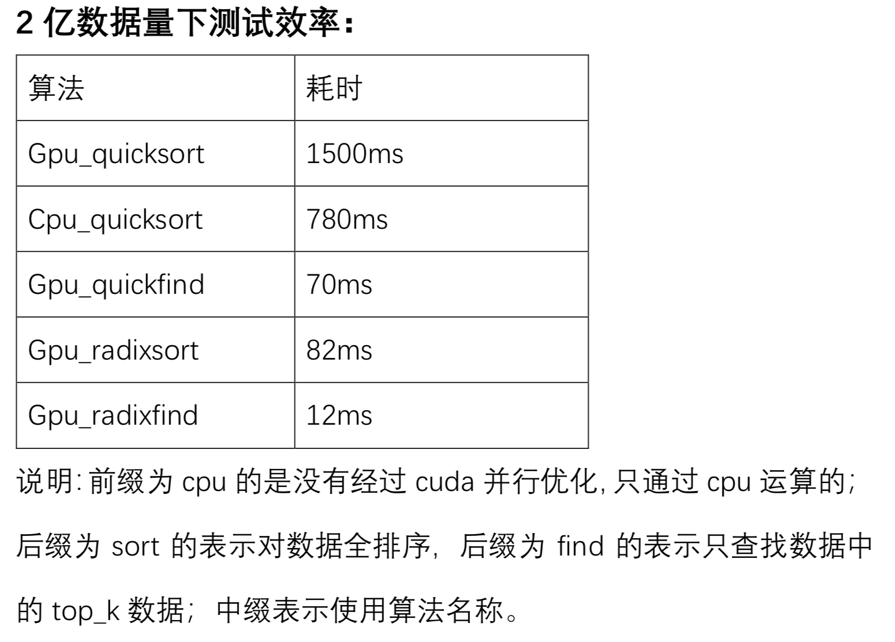

# gpu-find-topk
This is a project of finding top_k elements using gpu for accelerating the query

### Environment
Linux

### Dependencies
- c++ 14
- cuda 10.1
- Nvidia Graphics card

**Sampling**

- Run radixfind:
 - `cd radixfind code`
 - `Nvcc radix_select.cu -arch=sm_35 -rdc=true`

- Run quickfind:
 - `cd quickfind`
 - `Nvcc quickfind.cu -arch=sm_35 -rdc=true`
 
 
